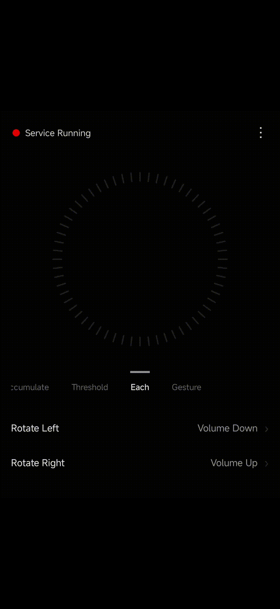
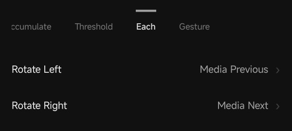
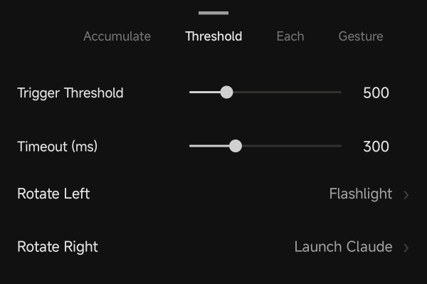
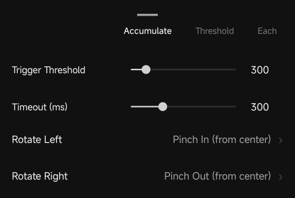
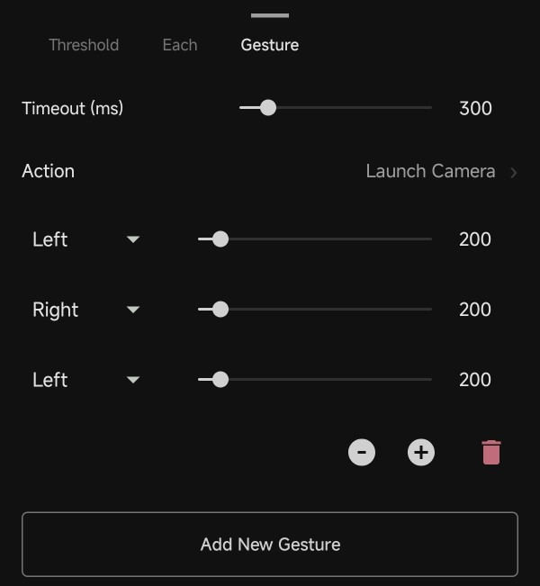
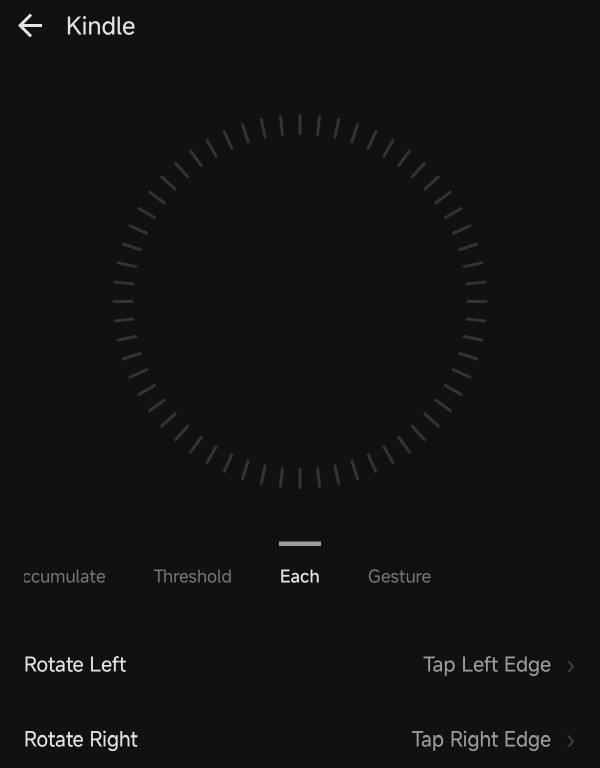

# RingController for Leica Leitzphone

 

This is a dedicated app for the ring controller on the [Leica Leitzphone powered by Xiaomi](https://www.mi.com/global/product/leica-leitzphone-powered-by-xiaomi/). It lets you customize ring behavior everywhere on the device. We believe the ring controller’s full potential is still underappreciated—the Leitzphone is one of the first phones to ship with a powerful controller integrated in a natural way. With this app you can perform actions such as volume up/down, toggling the flashlight, turning pages in the Kindle app, and much more. You can also customize behavior per app—for example, use the ring for volume in general but page turns only in Kindle.

The app reads raw ring sensor data and is implemented as an Android Accessibility Service using **C#** + [.NET for Android](https://learn.microsoft.com/en-us/dotnet/android/) + CoreCLR/Native AOT. Because it requests elevated privileges to work system-wide, we publish the source for transparency so you can verify it does nothing malicious.

## Getting Started

Install `com.cysharp.RingController.apk` from the Assets section on the [Releases](https://github.com/Cysharp/RingController/releases) page.

Tap the “Service Stopped” message at the top and enable the Accessibility Service in Accessibility settings. Check **Downloaded apps** → **RingController** → **Use RingController**. Once enabled, the top message changes to “Service Running” and the ring controller becomes active.

For reliable operation, we recommend turning **Quick launch off** and keeping **Camera ring haptic feedback always on** in the Leitzphone’s camera ring settings. In RingController’s app info, set **Battery to unrestricted**, turn off **Pause app activity if unused**, and **Lock the app** so the system is less likely to kill it. If the service was stopped by the system, turn the Accessibility Service off and on again.

Ring triggers can be chosen exclusively from four modes.

### Each

Mode tied to haptics as you rotate the ring. Suited to continuous actions (volume, brightness, previous/next media, page turns, etc.).

### Threshold

Fires an action once when accumulated rotation exceeds a threshold. Good for launching apps (Launch App), toggling the flashlight, play/pause media, and similar. Rotation resets after no ring movement for the configured timeout (milliseconds).

### Accumulate

Fires an action each time accumulated rotation crosses the threshold. The kinds of actions are the same as Each; choose this when you want a larger rotation per trigger. Rotation resets after no ring movement for the configured timeout (milliseconds).

### Gesture

Like the stock camera ring quick launch: perform actions when you rotate the ring in a configured sequence and amount. You can define multiple gestures. Rotation resets after no ring movement for the configured timeout (milliseconds).

## Actions

The following action types are available.

- None
- Volume Down/Up
- Brightness Down/Up
- Media Play/Pause
- Media Stop
- Media Previous
- Media Next
- Media Rewind
- Media Fast Forward
- Launch App
- Broadcast Intent
- Open URL
- Screenshot
- Lock Screen
- Flashlight
- Rotation Lock
- Tap Left/Right Edge
- Double Tap Left/Right Edge
- Swipe Left/Right
- Swipe Up/Down
- Pinch In/Out

**Tap Left/Right Edge** can simulate page turns in e-book readers. For apps that do not respond to taps, use **Swipe Left/Right**. **Swipe Up/Down** can simulate in-app scrolling.

**Broadcast Intent** can send triggers to macro apps that react to intents, such as MacroDroid or Tasker. Combined with those apps, you can run behaviors beyond the built-in preset actions.

## Per-app override

You can customize behavior per app. Choose **Add per-app override** and pick an app; settings here take precedence. To disable ring actions in a specific app, set both Rotate Left and Rotate Right to **None**.

## Settings

If **Run while screen is locked** is enabled, rotation still triggers actions on the lock screen. It is off by default. You can back up and restore settings with Import/Export.

## License

This library is under MIT License.
